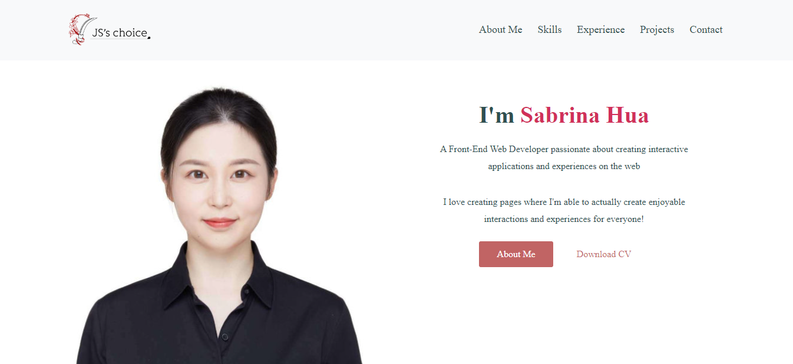
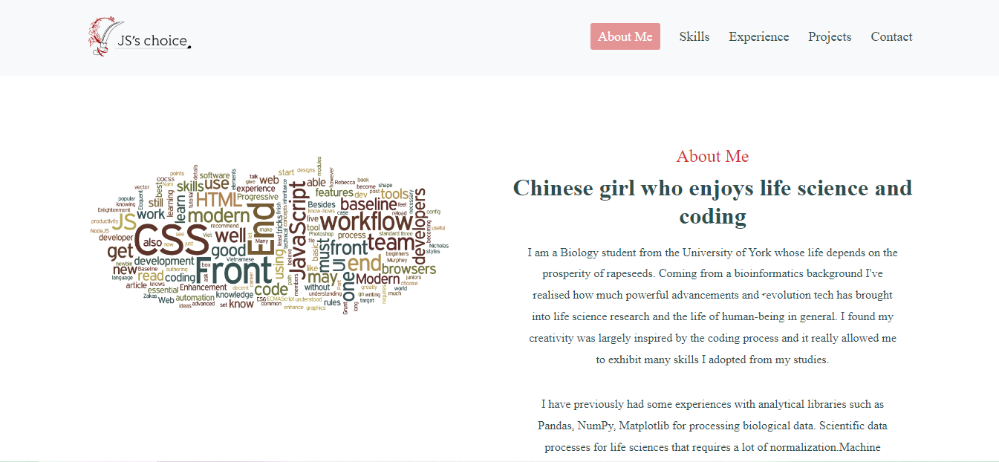
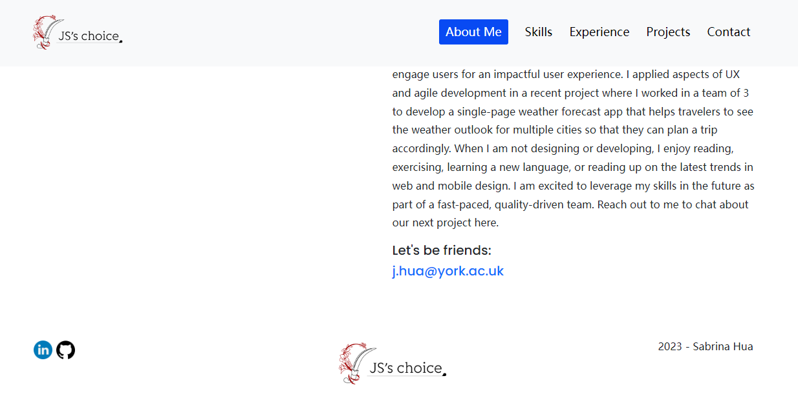
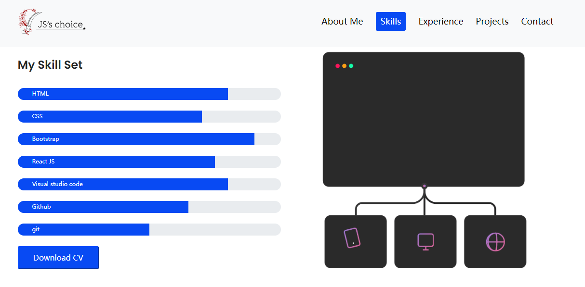
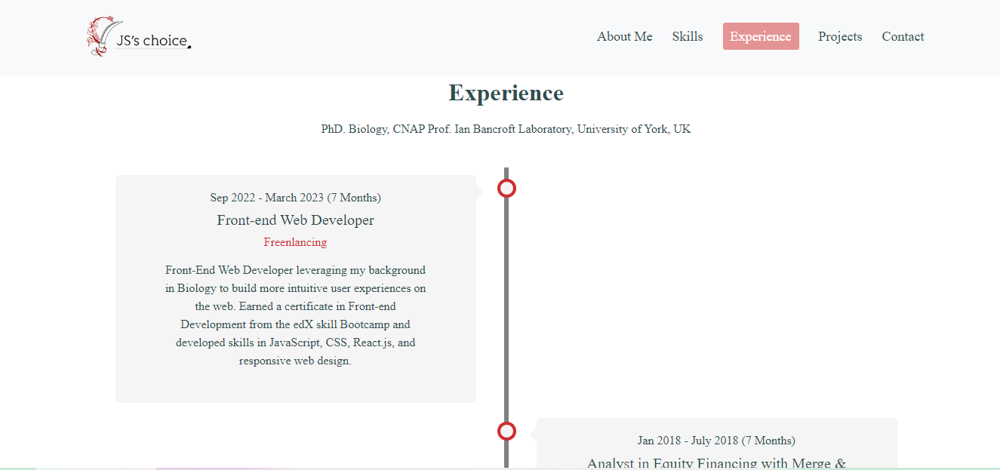
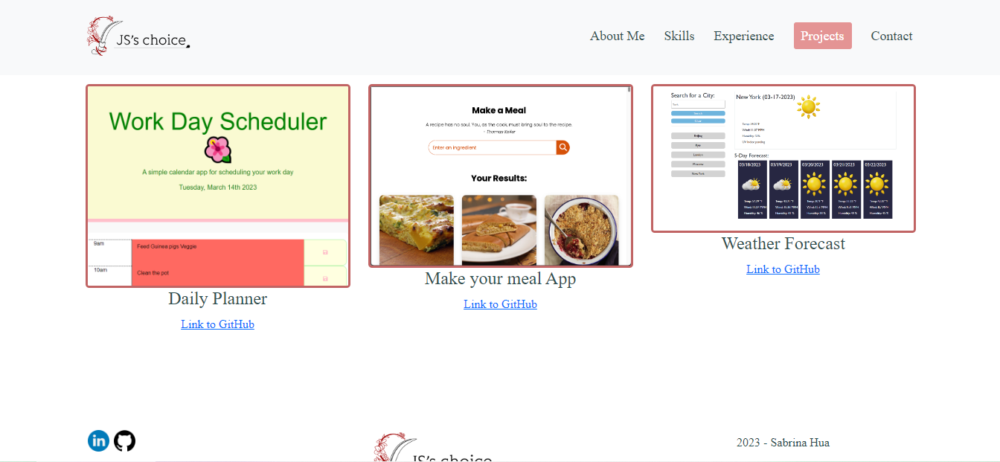
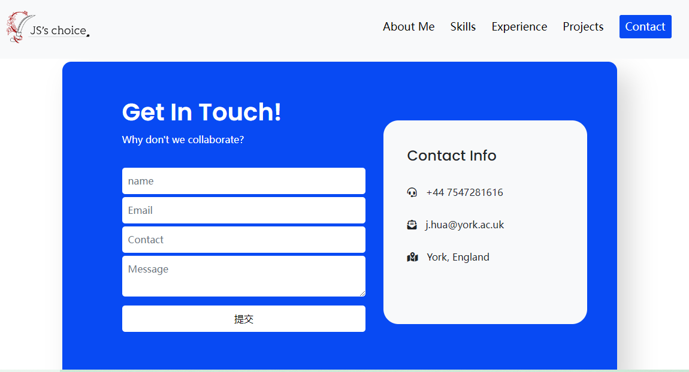

# SabrinaHuajy_React_Portofolio
MIT 
## Description 
         A portfolio of work to showcase my skills and talents to employers looking to fill a part-time or full-time position.
## Table of contents
- [SabrinaHuajy\_React\_Portofolio](#sabrinahuajy_react_portofolio)
  - [Description](#description)
  - [Table of contents](#table-of-contents)
  - [Installation](#installation)
  - [Usage](#usage)
  - [License](#license)
  - [Questions](#questions)
  - [Deployed website](#deployed-website)
  - [Illustration](#illustration)
## Installation
            Run npm install inquirer, React Router and then run node index.js
## Usage 
            For getting to know more about Sabrina Hua
## License
            MIT
            MIT license covered by MIT      
## Questions
    For questions regarding this application please contact me at:
        - E-mail: j.hua@york.ac.uk
        - Github:
        <https://github.com/SabrinaHuajy>

## Deployed website
Link to my portfolio Website - https://sabrinahua.netlify.app/

## Illustration
The following images illustrate the website's appearance and functionality:
 

